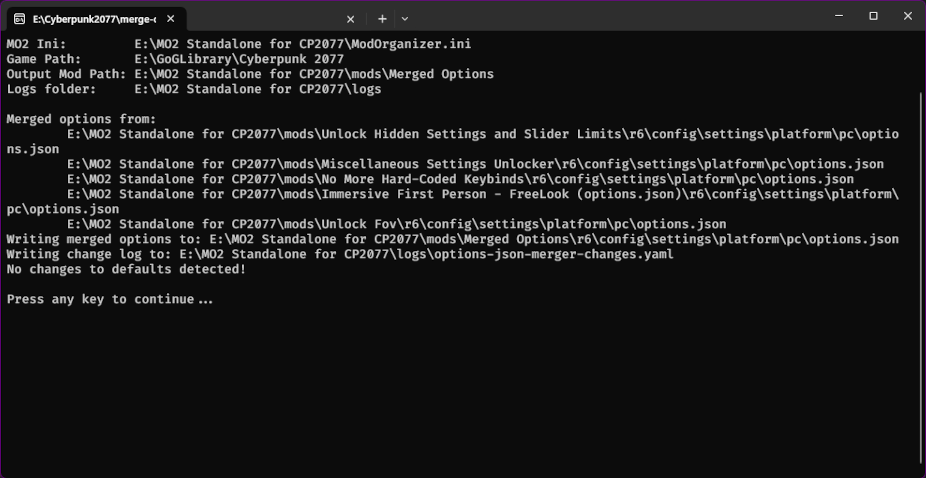
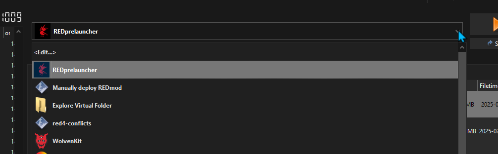
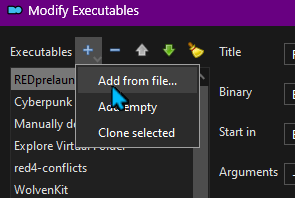
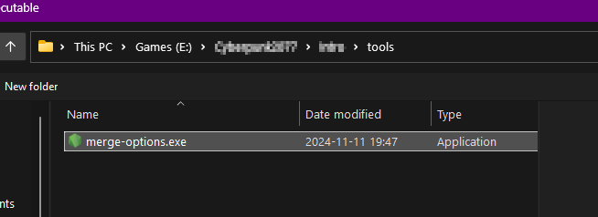
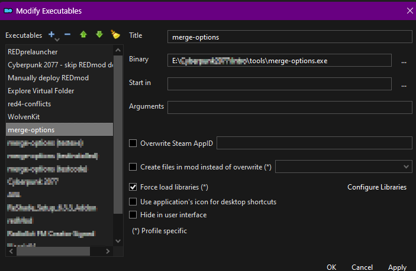

# Merge CP2077 Options for ModOrganizer 2

This is a tool for merging CP2077 options.json files. There are many mods
that include an options.json file, but CP2077 can only load one of them. 
With MO2 we have access to all of the source mods that will be used, which
gives us the opportunity to automatically resolve these conflicts.

## How To Use It

NOTE: If you are unsure of exactly you add tools to MO2, see the
[tutorial](#tutorial) at the bottom.

### For Global Installs of MO2

Extract the zip file somewhere you can easily find it. Add the tool to MO2 --
you don't need to set "Start in" or any arguments.

### For Standalone Installs of MO2

Extract the zip file into your MO2 folder. When that finishes you should
then have a tools folder inside your MO2 folder with with
`merge-options.exe` inside that.

Add the tool to MO2 -- ordinarily you shouldn't need to set a folder to run
from or any arguments.  The only time you would need to specify something is
if you put `merge-options.exe` somewhere else, in which case set it to start
in your MO2 folder.

## Running the Tool

As with other tools in MO2, select the merge-options entry from the
executables menu and hit "Run".  You'll see a black terminal window appear
with output (or errors if there were any).  Press any key to close it.



If you don't see a window like this it means that MO2 couldn't find the
executable you picked, or that Windows couldn't execute it for some reason.


To get a better idea of what's going on, try running it in a terminal window
and see what the error is.

To run it in a terminal window, first open up a terminal window by
pressing Win-R and entering "powershell" and clicking "Ok".

Head back to MO2 and bring the entry in Modify Exeutables for merge-options.exe and copy the "Binary" section.

Back to the Powershell window we opened, type `& "`, press Ctrl-Shift-V to insert the value we copied from MO2, and finally type `"` and press enter.

Before you hit enter, this should look something like `& "E:\Path\To\tools\merge-options.exe"`

If the output in that window does not make your problem obvious, please post
a screenshot to the Posts section on Nexus and I'll try to help you.


## Changing the Output Mod Name

By default, it will create a mod named "Merged Options" and write the merged
INIs to that folder. If you would like to use a different name, you can do so adding
to the arguments `--mod <modname>`, like:

```
--mod "My Amazing Modlist's Combined Options"
```

## How It Works

It walks through the active mods in your current MO2 profile looking for these:

`r6/config/settings/platform/pc/options.json`

It reads each in turn -- it determines what a change is by comparing it to
the version found in your Cyberpunk install.

## Seeing the Changes

If you want to see what it found that was different than the stock options
file, there's a file written to MO2's logs folder named
`options-json-merger-changes.yaml` that's hopefully fairly self explanatory. 
(It's currently pretty good but not perfect at identifying and sourcing all
the changes. It'll improve over time.)

## Command Line Options

> Form: merge-options [--help|-?] [--no-pause] [--dryrun|-n] [<mo2path>] [--mod=<outputMod>]

* <mo2path> - The path that has your ModOrganizer2.ini. If you don't specify a path then merge-options will try to find ini in "%LOCALAPPDATA%/ModOrganizer/Cyberpunk 2077", the folder it is running from, and the parent folder of that.
* <outputMod> - The name of the mod to write the merged ini file to. If it does not exist, it will be created. Default value is: Merged Options
* --no-pause - Don't wait for a keypress after running
* --dryrun - Don't write anything to disc, just report which files would be merged.

## Example options.json Mods

These are the mod's whose options.json's I merge in my own load order:

* [Unlock Hidden Settings and Slider Limits](https://www.nexusmods.com/cyberpunk2077/mods/13943)
* [Miscellaneous Settings Unlocker](https://www.nexusmods.com/cyberpunk2077/mods/8124)
* [No More Hard-Coded Keybinds](https://www.nexusmods.com/cyberpunk2077/mods/4008)
* [Immersive First Person - FreeLook (options.json)](https://www.nexusmods.com/cyberpunk2077/mods/2675)
* [Unlock Fov](https://www.nexusmods.com/cyberpunk2077/mods/7989)

## Tutorial

To add a tool, click on the list of executables next to the big "Run" button and select `<Edit...>`



This will pop open a new "Modify Executables" dialog. Click the + in the top right and pick `Add from file...`



This will open a windows file dialog -- browse to wherever you extracted `merge-options.exe` and select it.



And that's it -- you can click ok and close the dialog.



## License

This is MIT licensed, which basically means "do what you like, just don't
take credit for my work".  See the [LICENSE](LICENSE) file for the actual
legalize.

## On Nexus

The repo is on Nexus at: [nexusmods.com/cyberpunk2077/mods/17125](https://www.nexusmods.com/cyberpunk2077/mods/17125)

